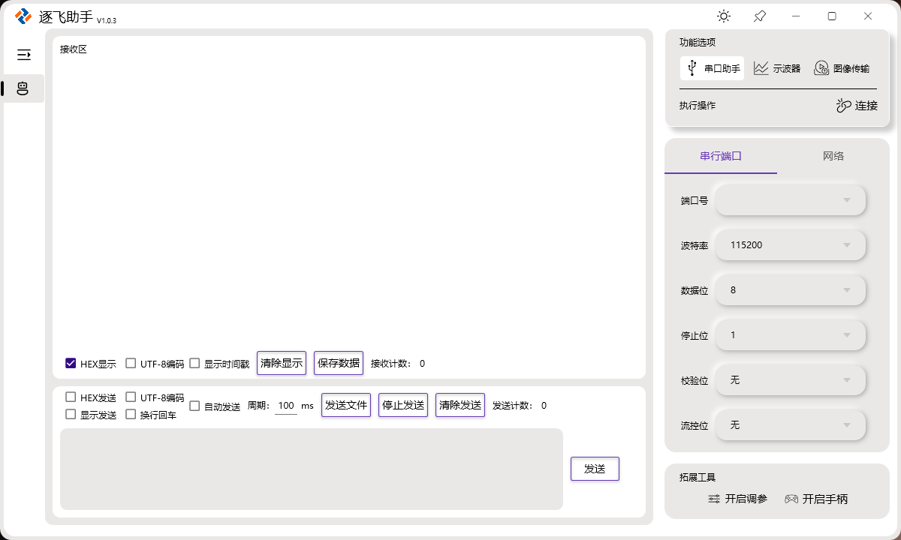
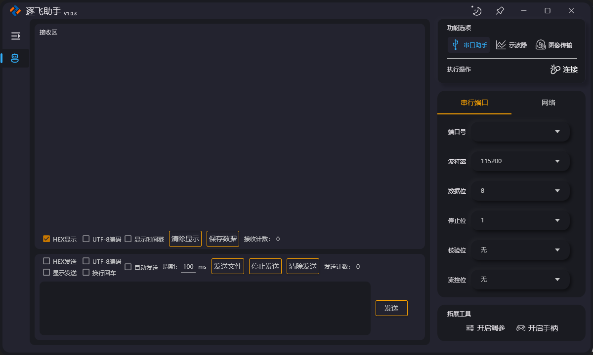
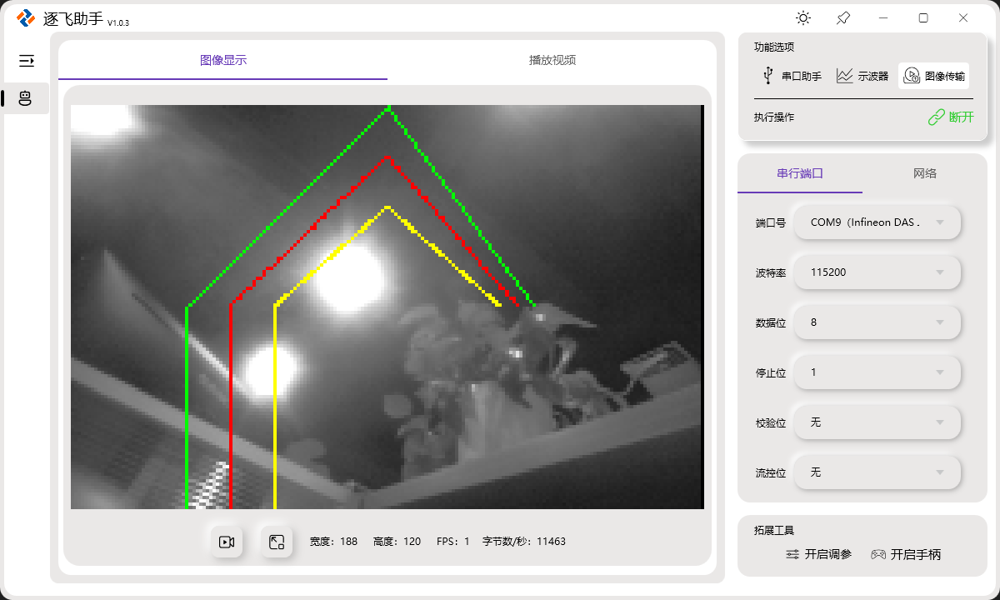
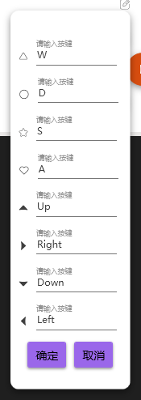

# 逐飞助手

逐飞助手是一款多功能的上位机软件，集成了串口助手、虚拟示波器以及摄像头图像显示等多种实用功能。我们将对其进行持续的更新迭代，不局限于对现有的功能进行完善和优化，还包括增加新的功能。因此，如果小伙伴们发现软件不完善的地方，希望你们能及时反馈给逐飞科技，也可以直接联系群管理JAY（QQ：2677611713）。有什么好的建议可以反馈给我们，感谢大家的支持。

## 配合逐飞高速WIFI SPI模块实现图传

下面的视频是用逐飞助手录制的。

**配合逐飞高速WiFi SPI无线模块，实现高帧率图传。该模块采用高性能单片机(160MHZ主频) 来进行数据转发，模块最大传输速度能达到2500KB/S以上(无线环境良好时)**。

[高速WIFI SPI无线模块 逐飞科技-淘宝网](https://item.taobao.com/item.htm?abbucket=12&id=763532112965&ns=1&spm=a21n57.1.0.0.20b0523cpGvxZ0)

## 软件介绍

逐飞助手目前主要包含三大功能：串口助手、虚拟示波器、摄像头图像显示。打开软件后，界面默认显示串口助手页面，如下图所示。

### 主题切换

小太阳图标是用于切换主题的按键，默认是浅色主题，用小太阳表示。点击后，主题会切换成深色，同时图标变成月亮，如图所示。大家可以根据个人喜好选择主题颜色。

### 窗口置顶

图钉样的图标是用于窗口置顶的按键，默认不置顶。如果希望软件始终位于窗口最前，则可点击此按键。点击后，图标变化即说明窗口已经置顶了。再次点击可以取消置顶，如下图所示。

### 调整窗口

如果需要调整窗口的大小，可以把鼠标置于窗体的右下角区域，且鼠标进入可缩放区域光标会发生变化，如图所示。

## 使用说明

详细的使用细节可以查看[逐飞助手说明书](https://gitee.com/seekfree/seekfree_assistant/tree/master/%E3%80%90%E6%96%87%E6%A1%A3%E3%80%91%E8%AF%B4%E6%98%8E%E4%B9%A6)，**说明书将随着软件更新不断迭代版本**，所以以下只做简要介绍说明。

### 串口助手的使用

逐飞助手的串口助手功能，实际上包含串行端口数据调试器和网络数据调试器，其中网络数据调试器支持TCP协议和UDP协议。

### 虚拟示波器的使用

功能选项点击示波器，页面将切换为虚拟示波器的页面，如下图所示。

#### 显示模式

**显示全部**：所有的数据点都会自适应显示在界面上。

**自动跟随**：实时显示最新一段数据，此为默认的显示方式。

#### 移动和缩放

**移动**：鼠标左键拖动可以对波形图进行移动操作。

**缩放**：鼠标右键拖动或者滚动鼠标滚轮可以对波形图进行缩放操作。

**特别说明**：因为鼠标右键和鼠标滚动对波形的缩放是X、Y轴同时缩放的，所以如果只想对X、Y轴其中一个轴进行缩放操作，可以点击固定Y轴、固定X轴按键后，再进行缩放操作。

#### 保存图片

鼠标点击波形显示区域后，右键单击此区域，会出现保存图片的菜单，可以选择将波形保存为图片。

#### 配合例程使用

这里我们以TC264为例。打开对应的逐飞助手虚拟示波例程(seekfree_assistant_oscilloscope_demo)，编译并下载到核心板中。然后，我们打开逐飞助手，按照下面截图，依次点击。

连接后，逐飞助手上面虚拟示波器有四个通道进行显示。

### 摄像头图像显示（图传）的使用

功能选项点击图像传输，页面将切换为摄像头图像显示的页面。页面暂时只有两大部分，一部分是实时的摄像头图像数据显示区，另一部分是视频播放区，如下图所示。

#### 配合例程使用

这里我们以TC264显示通过串口显示灰度图像到逐飞助手为例。打开对应的逐飞助手发送总钻风灰度图像的例程(seekfree_assistant_mt9v03x_demo)编译并下载到核心板中。
然后，我们打开逐飞助手，按照下面截图，依次点击。

连接后，我们就可以看到图像和边线在显示了。

#### 其他摄像头图像显示效果

显示小钻风的图像

显示凌瞳的图像

### 调参工具

点击拓展工具中的开启调参，软件将弹出调参工具的窗口，如下图所示。

标题栏右侧两个图标分别为，恢复通道默认配置按键和关闭调参窗口按键。点击恢复通道默认配置按键，会将所有通道恢复成初始配置。此窗口和主窗口一样，可以在右下角的位置对窗口进行大小的调整。

参数调试默认预留8个通道，每个通道参数默认最小值为0，最大值为1000，步进值为1。最值、步进值以及参数名称都支持修改。

#### 配合例程使用

这里我们以TC264为例。打开对应的逐飞助手参数调试例程(seekfree_assistant_parameter_debug_demo)编译并下载到核心板中，然后按照下图依次点击。

我们可以通过拖动、点击+号、点击-号和手动输入的方式来调整参数，同时串口助手可以观察到每个通道的值。

### 虚拟手柄

虚拟手柄可以配合无线模块，当遥控器使用。点击拓展工具中的开启手柄，软件将弹出虚拟手柄的窗口，如下图所示。

蓝色四个按键，默认绑定键盘上的W（三角形）、D（圆圈）、S（五角星）、A（爱心）。

橘红色四个按键，默认绑定键盘的方向键，上、下、左、右和图标箭头方向对应。

**特别说明**：键盘快捷键生效需要虚拟手柄窗口被激活，点击下窗口任意位置即被激活。

当建立通信连接后，每点击一次按键将发送对应的键值。如串口助手建立通信连接后，按下键盘的W，串口将发送字符："W\r\n"。界面上也会显示”W“，2秒后消失。

再比如按下方向键↑，串口将发送字符："Up\r\n”，界面上也会显示“Up”，2秒后消失。

#### 快捷键修改

虚拟手柄支持快捷自定义，如下图所示。

点击文本框，按下键盘上的按键即可。组合键只支持两个键组合如：“Ctrl+Q”。如果快捷键输入错误可以按下键盘上的删除键（BackSpace）后，重新输入，输入完成后点击保存，快捷键即被修改。
